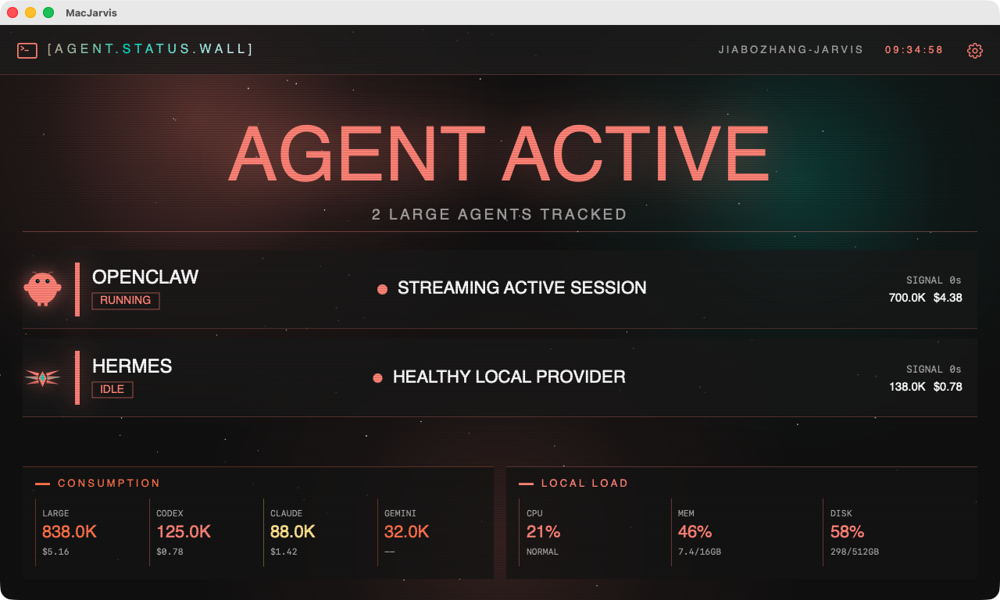

# MacJarvis

English | [简体中文](README.zh-CN.md)

MacJarvis is a native macOS SwiftUI status wall for small always-on 5-inch and 7-inch displays, typically running at 1024 or 1280 px wide. It prioritizes large-agent health, token consumption, and local system load.



The default screen is organized around whether the agent layer is working:

- Main readout: global health for installed large agents, prioritizing nominal, active, stuck, offline, and error states
- Large agents: OpenClaw and Hermes are shown only when installed; missing installs are not treated as faults
- Consumption: OpenClaw / Hermes large-agent usage is separated from Codex / Claude / Gemini small-agent usage
- Local status: CPU and memory remain visible; the system detail page also shows disk usage
- Rotation: status, consumption detail, and system detail pages rotate automatically; large-agent faults interrupt rotation

## Capabilities

- Local usage collection for Codex, Claude, and Gemini
- OpenClaw gateway connection, health checks, activity state, and usage aggregation
- Hermes local auto-discovery, gateway state reading, and SQLite usage aggregation
- Push-to-Talk voice input with local WhisperKit transcription
- CPU, memory, and disk monitoring
- Persistent OpenClaw connection parameters and daily budget settings
- Cyber-terminal status wall UI optimized for 5-inch and 7-inch small screens

## Tech Stack

- SwiftUI, macOS 14+
- `@Observable` with Environment state injection
- WhisperKit local speech recognition
- AVSpeechSynthesizer TTS capability
- Direct SQLite3 / JSON reads from local tool data
- XcodeGen-managed project files

## Local Data Sources

MacJarvis does not use a cloud statistics API. It reads local data directly:

- Codex: `~/.codex/state_5.sqlite`
- Claude: `~/.claude/plugins/claude-hud/.usage-cache.json`
- Gemini: `~/.gemini/tmp/*/chats/session-*.json`
- OpenClaw gateway usage: `openclaw gateway usage-cost --json`
- Hermes: `~/.hermes/gateway_state.json`, `~/.hermes/gateway.pid`, `~/.hermes/state.db`

Notes:

- Codex small-agent usage no longer falls back to OpenClaw gateway usage, avoiding duplicated OpenClaw large-agent consumption
- Claude currently shows the 5-hour usage percentage and plan name from the `claude-hud` cache
- Gemini currently counts today's sessions only and does not show real token counts

## Status Wall Behavior

Large agents are OpenClaw and Hermes. They have installation state, runtime state, and consumption data. Small agents are Codex, Claude Code, and Gemini; the default screen shows their consumption only and does not infer runtime health.

The status wall rotates automatically:

- The main status page stays on screen the longest for always-on observation
- The consumption detail page shows grouped large-agent and small-agent usage
- The system detail page shows CPU, memory, and disk usage
- Large-agent stuck, offline, or error states show a fault interrupt page until recovery

Development preview can be launched with a fixture:

```bash
open -na /path/to/MacJarvis.app --args -ApplePersistenceIgnoreState YES --fixture healthy-openclaw --page status
```

Available fixtures include `healthy-openclaw`, `no-large-agents`, `stuck-openclaw`, `error-openclaw`, `mixed-openclaw-hermes`, and `missing-small-token`.

## Build

```bash
brew install xcodegen
xcodegen generate
xcodebuild -project MacJarvis.xcodeproj -scheme MacJarvis -configuration Debug build
```

Test:

```bash
xcodebuild -project MacJarvis.xcodeproj -scheme MacJarvis -configuration Debug clean build-for-testing
xcodebuild -project MacJarvis.xcodeproj -scheme MacJarvis -configuration Debug test-without-building
```

## OpenClaw Configuration

MacJarvis talks to OpenClaw through the OpenAI-compatible `/v1/chat/completions` endpoint. This endpoint is disabled by default and must be enabled manually.

### 1. Enable `chatCompletions`

Edit `~/.openclaw/openclaw.json`:

```json
{
  "gateway": {
    "port": 18789,
    "auth": {
      "mode": "token",
      "token": "<your-token>"
    },
    "http": {
      "endpoints": {
        "chatCompletions": { "enabled": true }
      }
    }
  }
}
```

### 2. Restart OpenClaw

```bash
pkill -f openclaw
openclaw gateway start
```

### 3. Verify the endpoint

```bash
curl -X POST http://127.0.0.1:18789/v1/chat/completions \
  -H "Content-Type: application/json" \
  -H "Authorization: Bearer <your-token>" \
  -d '{"model":"openclaw","messages":[{"role":"user","content":"ping"}],"stream":false}'
```

The response should include `choices[0].message.content`.

### 4. Configure the app

The Settings panel needs:

| Field | Description |
|-------|-------------|
| `HOST` | `127.0.0.1` or a Tailscale IP |
| `PORT` | Default `18789` |
| `TOKEN` | OpenClaw gateway token |
| `AGENT` | Default `main` |

The app attempts to auto-connect on launch using saved settings.

## WhisperKit Model

On first launch, WhisperKit downloads `openai_whisper-base` if the model files are not already present.

For offline preparation, place the model at:

```text
~/Documents/huggingface/models/argmaxinc/whisperkit-coreml/openai_whisper-base/
```

## External Display Behavior

The app attempts to detect a display near 800x480 and move the window there. Matching allows a 10% tolerance to handle scaling and panel differences.

## Current Limitations

- README reflects the current implementation, not the original design draft
- Claude data depends on the local `claude-hud` plugin cache; usage is hidden when that file does not exist
- Gemini currently shows session count only, not token count
- TTS capability exists in code, but automatic announcements are not fully wired back into the new UI
- System monitoring currently shows CPU / memory / disk, not the CPU / temperature pair from older docs
- OpenClaw chat, embedded terminal, and PTT controls have been moved out of the default always-on screen and belong to a future debug/operator mode

## Install on Another Mac

1. Open `MacJarvis.dmg` and drag the app into Applications
2. On first launch, right-click the app and choose Open
3. Grant microphone permission to enable voice input
