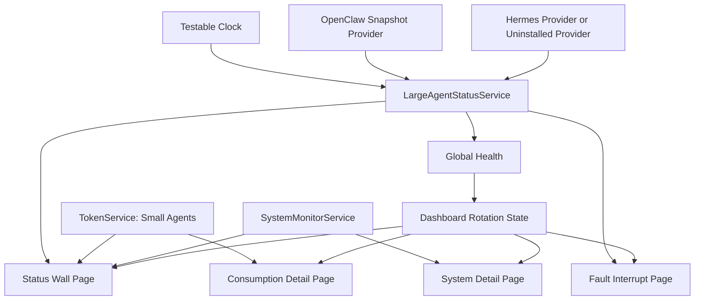

# feat: Agent Status Wall

## Summary

Replace the current tabbed cockpit-style dashboard with an always-on small-screen agent status wall. The implementation centers installed large-agent health for OpenClaw and Hermes, keeps token and local system health as secondary readouts, and rotates automatically between status, consumption, and system detail screens.

---

## Problem Frame

MacJarvis now has the raw ingredients for the requested screen: OpenClaw status, local token/cost collection, CPU/memory/disk monitoring, scaling for small external displays, and a strong cyber terminal visual identity. The current composition still behaves like a desktop app: a header, left/middle/right panels, terminal/log area, and bottom tab navigation.

The origin requirements call for a different product shape: on a 5-inch or 7-inch always-on screen, the first read must be whether installed large agents are available, running, idle, stuck, or failed. Token consumption and machine load must remain visible, but they should not compete with agent health as equal columns.

---

## Requirements Trace

Requirement IDs in this plan are inherited from `docs/brainstorms/2026-05-29-small-screen-agent-status-wall-requirements.md`.

**Overall Layout**

- R1. Replace the current left/middle/right information layout with a status-wall composition centered on large-agent health.
- R2. Make global large-agent status the largest visual element on the main screen.
- R3. Show only installed large agents; missing OpenClaw or Hermes installations must not appear as faults.
- R4. Keep token consumption and local system health visible as compact secondary summaries.
- R5. Optimize layout readability for 5-inch and 7-inch always-on displays around 1024px or 1280px wide.

**Large-Agent Status**

- R6. Support online, offline, running, idle, stuck/warning, error, and unknown for OpenClaw and Hermes.
- R7. Derive global status only from installed large agents.
- R8. Mark stale heartbeat or activity as stuck/warning rather than normal.
- R9. Let clear large-agent failure dominate the screen until recovery.
- R10. Include enough context on each large-agent status block to explain state at a glance.

**Consumption and Local System**

- R11. Display token or cost consumption alongside large-agent status.
- R12. Display small-agent consumption without implying runtime health.
- R13. Distinguish large-agent consumption from small-agent consumption.
- R14. Provide consumption detail pages with per-agent totals, costs, buckets, and last-updated information.
- R15. Show compact CPU and memory on the main screen; include disk only where space allows.
- R16. Show CPU, memory, and disk on the local system detail page.
- R17. Let local system warnings raise attention without overriding large-agent error.

**Rotation, Interaction, and Visual Design**

- R18. Rotate automatically between main status, consumption detail, and local system detail.
- R19. Give the main status screen the longest normal dwell time.
- R20. Stop rotation on stuck/warning or error until the large-agent condition recovers.
- R21. Do not depend on manual page switching for routine operation.
- R22. Keep only a subdued settings entry as required manual control.
- R23. Make the UI read like an embedded operational panel rather than a general desktop app.
- R24. Use state color and motion to reinforce normal, running, warning/stuck, and error.
- R25. Avoid dense cards, nested panels, and competing decorative chrome.
- R26. Preserve the MacJarvis dark/neon/CRT identity while changing hierarchy and composition.

---

## Key Technical Decisions

- **Installation is metadata, not runtime state.** `LargeAgentSnapshot` should carry `isInstalled` separately from runtime status. Runtime status excludes `uninstalled`; uninstalled snapshots are filtered out of the main surface and global health.
- **Use origin R-IDs for traceability.** Implementation units cite the origin requirement IDs above, avoiding a second plan-local R-ID namespace with different meanings.
- **Use snapshot providers with one polling owner.** `LargeAgentStatusService` owns the refresh timer and clock. Provider adapters read OpenClaw/Hermes state and return snapshots; the aggregator computes installed agents and global health.
- **Hermes is optional until its contract is confirmed.** The first implementation must support an uninstalled/no-op Hermes provider so OpenClaw-only machines can ship. Real Hermes health and consumption support starts only after the Hermes contract gate defines discovery, health, auth, payloads, and mappings.
- **OpenClaw needs explicit installation detection.** An unreachable OpenClaw service is not enough to decide installed vs absent. The first version should treat OpenClaw as installed when the `openclaw` executable, `~/.openclaw` configuration/session data, or explicit user configuration exists.
- **Separate OpenClaw gateway usage from Codex usage.** OpenClaw gateway records should feed the OpenClaw large-agent snapshot. Codex small-agent consumption should use Codex subscription/API data, not the OpenClaw gateway fallback currently present in `TokenService`.
- **Keep small agents consumption-only.** Existing `TokenService.tools` remains the source for Claude Code, Codex, and Gemini consumption, but it must not affect global large-agent health.
- **Make page rotation deterministic.** Rotation should be a pure, testable state machine with injected clock support for unit and UI tests.
- **Demote terminal and embedded CLI surfaces.** OpenClaw chat and embedded terminal views remain available for future debug/operator flows, but they are not part of the first version's default always-on status wall.
- **Reuse current scale/theme infrastructure.** Preserve `@Observable`, SwiftUI Environment injection, `AppTheme`, `scaleFactor`, `PixelProgressBar`, `StarfieldBackground`, and CRT effects rather than adding a new design system.

---

## High-Level Technical Design

The provider layer owns protocol-specific reads; `LargeAgentStatusService` owns cadence, snapshot aggregation, and global health. The dashboard renders read models only. In UI tests, a fixture provider and injected clock replace live health/network/timer behavior.

---

## Runtime State Defaults

### Agent State Treatment

| Runtime state | Global headline | Agent label | Severity | Motion | Interrupts rotation | Accessibility phrase |
|---|---|---|---|---|---|---|
| no installed large agents | NO LARGE AGENTS | hidden | neutral | none | no | No large agents configured |
| unknown | CHECKING AGENTS | CHECKING | neutral | subtle scan if motion allowed | no | Agent status is being checked |
| idle | SYSTEM NOMINAL | IDLE | normal | stable glow | no | Agent is online and idle |
| running | AGENT ACTIVE | RUNNING | normal-active | pulse or sweep | no | Agent is online and running |
| stuck | AGENT STUCK | STUCK | warning | slow amber blink | yes | Agent appears stuck; activity is stale |
| offline | AGENT OFFLINE | OFFLINE | error | steady red | yes | Installed agent is offline |
| error | AGENT ERROR | ERROR | error | steady red plus short pulse | yes | Agent reported an error |

All status views must include visible text in addition to color and motion. Reduced Motion should disable or soften starfield, CRT, pulse, blink, and sweep effects while preserving status text and color.

### Stuck and Recovery Semantics

| Agent | Installed signal | Health signal | Running signal | Stuck rule | Recovery rule |
|---|---|---|---|---|---|
| OpenClaw | `openclaw` executable, `~/.openclaw` data, or explicit saved configuration | periodic `/health` check owned by the OpenClaw provider | `isStreaming`, active mirror update, or explicit active session signal | only a running/active agent with no fresh health or activity for 120 seconds becomes stuck; quiet healthy agents become idle, not stuck | two consecutive successful health/activity reads or 15 seconds of stable healthy state clears stuck/error |
| Hermes | contract-defined discovery signal; absent contract uses uninstalled provider | contract-defined health read | contract-defined activity field or heartbeat | same default threshold after contract mapping exists | same recovery rule after contract mapping exists |

Explicit service errors beat timeout state. Startup unknown state should not interrupt rotation until the first health result or installation decision is known.

### Rotation Timing

| Page | Normal dwell | Notes |
|---|---:|---|
| Main status | 45 seconds | default landing page and recovery page |
| Consumption detail | 12 seconds | skipped only if no consumption source has any data |
| Local system detail | 12 seconds | always available when system monitor is running |
| Fault interrupt | indefinite | exits only after recovery rule clears stuck/error |

When a fault clears, the dashboard returns to the main status page for at least 30 seconds before resuming normal detail rotation. Opening settings freezes rotation behind the overlay.

### Detail Page Hierarchy

- Consumption detail starts with installed large agents and their status plus usage, then shows small-agent usage-only rows, then last-updated/stale/missing data indicators.
- System detail prioritizes CPU and memory first, then disk. Disk is required on the detail page but optional on the main compact strip when horizontal space is tight.
- Missing or stale token/system data should display as a muted readout, not as a large-agent fault.

### Security and Data Handling

- New Hermes credentials must not be stored in plaintext `UserDefaults`. If the contract requires a token, store it in Keychain or an equivalent local secret store and redact it from logs, UI-test fixtures, and status text.
- Hermes health and consumption checks are local/private by default. The first version should reject public internet targets unless a later explicit requirement adds remote support.
- Adapter boundaries may pass only normalized state, coarse heartbeat/activity age, aggregate token/cost totals, and short redacted status reasons to UI/logs.
- Raw health responses, prompts, request bodies, credentials, and raw usage payloads must be dropped or redacted before they reach snapshots, logs, or UI tests.
- Consumption data is displayed from aggregate in-memory records. Do not add new persistence of raw token/cost payloads in this work.

### Test Fixtures and Viewport Verification

- `--uitesting` should disable live network health checks, terminal auto-launch, and wall-clock rotation.
- UI tests should accept deterministic fixture names for at least: `healthy-openclaw`, `no-large-agents`, `stuck-openclaw`, `error-openclaw`, `mixed-openclaw-hermes`, and `missing-small-token`.
- Fixtures seed large-agent snapshots, small-agent token summaries, system summaries, current dashboard page, and a test clock value.
- Unit tests should cover rotation using an injected clock instead of sleeping.
- Visual verification must cover 1024px and 1280px wide windows for main status, consumption detail, system detail, and fault interrupt. Longest expected strings must not clip, overlap, or replace the status wall with terminal-tab UI.

---

## Implementation Units

### U1. Large Agent Status Domain

**Goal:** Define the shared state model and health aggregation used by the new status wall.

**Requirements:** R3, R6, R7, R8, R9, R10, R20

**Dependencies:** None

**Files:**

- Create: `MacJarvis/Models/LargeAgentStatus.swift`
- Test: `MacJarvisTests/LargeAgentStatusTests.swift`

**Approach:**

- Add an enum for large-agent kind, starting with OpenClaw and Hermes.
- Add a runtime status enum for unknown, offline, idle, running, stuck, and error. Do not include `uninstalled` in the runtime enum.
- Add a snapshot struct that carries kind, display name, `isInstalled`, runtime status, optional last activity/heartbeat, optional redacted status detail, optional aggregate token/cost summary, and computed severity.
- Add pure helpers that filter installed agents, compute global health, and identify whether rotation should be interrupted.
- Encode the state treatment and stuck/recovery semantics from this plan in deterministic helpers that accept `now` and threshold inputs.

**Patterns to follow:**

- `MacJarvis/Models/ClawStatus.swift` for small, testable status models.
- `MacJarvis/Models/ToolUsage.swift` for lightweight display-oriented model formatting.

**Test scenarios:**

- Covers AE1. Given OpenClaw is installed and Hermes is not installed, installed-agent filtering returns only OpenClaw and global health ignores Hermes.
- Covers AE2. Given a running installed agent has stale activity beyond 120 seconds, status evaluation returns stuck/warning.
- Covers AE3. Given one installed agent is error and another is healthy, global health is error and rotation interruption is true.
- Given no large agents are installed, global health returns the no-large-agents neutral state rather than error.
- Given an idle agent has old activity but fresh health, timeout evaluation keeps it idle rather than stuck.
- Given stuck/error receives two consecutive healthy reads or 15 seconds of stable healthy state, recovery clears the interrupt.

**Verification:** Unit tests cover installation filtering, timeout behavior, recovery behavior, severity ordering, and global health aggregation without requiring live services.

### U2. OpenClaw Snapshot Provider

**Goal:** Adapt existing OpenClaw connection, live health, activity, and usage data into the shared large-agent snapshot model.

**Requirements:** R3, R6, R8, R9, R10, R11, R20

**Dependencies:** U1

**Files:**

- Modify: `MacJarvis/Services/OpenClawService.swift`
- Modify: `MacJarvis/Services/TokenService.swift`
- Test: `MacJarvisTests/OpenClawServiceTests.swift`
- Test: `MacJarvisTests/ModelPricingTests.swift`
- Test: `MacJarvisTests/TokenServiceTests.swift`

**Approach:**

- Add OpenClaw installation detection using the first-version signals from Runtime State Defaults.
- Add periodic OpenClaw health ownership to the OpenClaw provider path. The provider maps happy, absent, offline, stale, and explicit-error paths into `LargeAgentSnapshot`.
- Treat `.running` plus `isStreaming`, active mirror updates, or an explicit active-session signal as running; treat healthy quiet state as idle.
- Reuse `parseOpenClawGatewayUsage(data:)` for OpenClaw large-agent consumption, but route OpenClaw gateway records only into the OpenClaw large-agent snapshot.
- Remove the current Codex API-mode fallback that labels OpenClaw gateway usage as Codex, or replace it with explicit source labeling that prevents double display.
- Keep OpenClaw chat and terminal UI out of the new main screen; this unit only creates the status/consumption feed.

**Patterns to follow:**

- Existing `OpenClawService.connectedAt`, `isStreaming`, and mirror update flow.
- Existing `TokenService` OpenClaw gateway usage parsing and `aggregateTokens` behavior.

**Test scenarios:**

- Covers AE1. Given no OpenClaw executable/config/user configuration exists, provider snapshot is not installed and is omitted from global health.
- Given OpenClaw is installed but `/health` refuses connection, provider snapshot is offline and interrupts rotation.
- Given OpenClaw is installed and `/health` returns a protocol/server failure, provider snapshot is error.
- Given a running OpenClaw service with `isStreaming == true`, provider snapshot is running.
- Given a running OpenClaw service with stale active activity, provider snapshot can be marked stuck by the shared timeout helper.
- Given OpenClaw gateway usage JSON, token records aggregate into the OpenClaw large-agent token summary.
- Regression: OpenClaw gateway usage displayed under OpenClaw is not also displayed as Codex small-agent usage.

**Verification:** OpenClaw snapshot mapping is covered by unit tests and existing gateway usage parser tests continue to pass.

### U3. Hermes Optional Provider and Contract Gate

**Goal:** Add an optional Hermes provider that can safely report uninstalled status now and support real health/consumption only after the Hermes contract is confirmed.

**Requirements:** R3, R6, R7, R8, R9, R10, R11, R20

**Dependencies:** U1

**Files:**

- Create: `MacJarvis/Services/HermesService.swift`
- Optional if token auth is confirmed: `MacJarvis/Services/AgentCredentialStore.swift`
- Modify: `MacJarvis/Services/SettingsService.swift`
- Modify: `MacJarvis/Views/SettingsView.swift`
- Test: `MacJarvisTests/HermesServiceTests.swift`
- Test: `MacJarvisTests/SettingsServiceTests.swift`

**Approach:**

- Start with a Hermes provider that can return `isInstalled == false` and can be replaced by deterministic test fixtures.
- Before implementing real Hermes health or consumption, document the local contract in code comments/tests: discovery signal, health request, authentication, response fields, activity/heartbeat mapping, consumption format, nil/empty/error behavior, and trust boundary.
- Do not add Hermes token persistence until a token requirement is confirmed. If confirmed, store secrets in Keychain or an equivalent local secret store, not plaintext `UserDefaults`.
- Store only non-secret Hermes configuration in `SettingsService`, and only after the contract requires user-visible configuration.
- Keep the provider local/private by default; reject public internet targets unless later scope explicitly permits them.

**Patterns to follow:**

- `SettingsService` UserDefaults persistence for non-secret host/port-style settings.
- `OpenClawService.connect(host:port:token:agent:)` for `@Observable @MainActor` service shape, without copying its plaintext token persistence.
- `TokenService.findExecutable` style for local command detection if Hermes installation is CLI-discoverable.

**Test scenarios:**

- Covers AE1. Given Hermes is not detected or contract is unavailable, the provider snapshot reports not installed and global health ignores it.
- Given Hermes fixture reports healthy idle/running, snapshot maps to the matching runtime status.
- Given Hermes fixture reports service error, snapshot maps to error.
- Given Hermes consumption data is unavailable, status still renders and token summary is empty or placeholder.
- Security: if Hermes token support is added, token values are not stored in `UserDefaults`, logs, or UI-test fixture text.
- Trust boundary: public remote Hermes hosts are rejected or treated as invalid in the first version.

**Verification:** Hermes behavior can be tested with fixture providers without requiring a real Hermes installation. Real Hermes adapter work is blocked until the contract is known.

### U4. Large Agent Status Service

**Goal:** Combine provider snapshots into one dashboard-facing source of truth with centralized cadence and test-clock support.

**Requirements:** R3, R6, R7, R8, R9, R10, R11, R20

**Dependencies:** U1, U2, U3

**Files:**

- Create: `MacJarvis/Services/LargeAgentStatusService.swift`
- Modify: `MacJarvis/MacJarvisApp.swift`
- Test: `MacJarvisTests/LargeAgentStatusServiceTests.swift`

**Approach:**

- Add an `@Observable @MainActor` service that owns one refresh timer and one injected clock.
- Call OpenClaw and Hermes providers on the service cadence, then publish installed large agents plus global health.
- Keep protocol-specific health/usage details in providers; `LargeAgentStatusService` aggregates only.
- Avoid duplicate network or usage refreshes by not reading OpenClaw gateway usage through `TokenService.tools`.
- Allow UI tests to inject fixture providers and a frozen/manual clock.
- Starting monitoring twice must not create duplicate timers.

**Patterns to follow:**

- `TokenService.startAutoRefresh(settings:)` timer lifecycle.
- `SystemMonitorService.startMonitoring()` periodic update pattern.
- `MacJarvisApp` Environment injection style.

**Test scenarios:**

- Given OpenClaw installed/running and Hermes uninstalled, published installed agents contains only OpenClaw and global health is normal.
- Given Hermes fixture reports error and OpenClaw is idle, global health is error.
- Given one installed agent is stuck and none are error, global health is warning/stuck and interruption is true.
- Given small-agent token data changes, global health does not change.
- Given fixture providers and a manual clock, refresh publishes deterministic snapshots without live network calls.
- Timer lifecycle: starting monitoring twice does not create duplicate update loops.

**Verification:** Status aggregation is deterministic in unit tests and the app injects the new service through Environment.

### U5. Passive Dashboard Rotation

**Goal:** Replace manual tab-driven page selection with passive rotation and fault interruption.

**Requirements:** R18, R19, R20, R21, R22

**Dependencies:** U4

**Files:**

- Create: `MacJarvis/Models/DashboardPage.swift`
- Modify: `MacJarvis/Views/DashboardView.swift`
- Test: `MacJarvisTests/DashboardPageTests.swift`

**Approach:**

- Add a passive page enum for status, consumption detail, system detail, and fault interrupt.
- Add pure rotation helpers that choose the next page based on current page, elapsed time, settings overlay state, and global health.
- Use the Rotation Timing defaults from this plan.
- Stop normal rotation whenever global health requires interruption and resume via the post-recovery rule.
- Remove `ActiveTab` from the default dashboard path; keep `ActiveTab`, `EmbeddedTerminalView`, and `TerminalSessionService` available but out of the status-wall main loop.

**Patterns to follow:**

- Current `DashboardView` local `@State` ownership for page-like UI state.
- Existing timer usage in `HeaderView` and `CoreStatusView`, but with pure helpers for decisions.

**Test scenarios:**

- Covers AE3. Given the next scheduled page is consumption and global health becomes error, selected page is fault interrupt.
- Covers AE5. Given healthy global state, rotation advances status -> consumption -> system -> status without user input.
- Given status page dwell has not elapsed, rotation remains on status.
- Given fault condition clears, rotation returns to the status page for the required recovery dwell before resuming details.
- Given settings overlay opens, rotation state remains stable behind it.
- Unit tests use an injected clock and do not sleep.

**Verification:** Rotation decision tests pass without SwiftUI view rendering, and manual bottom navigation is no longer required for the main experience.

### U6. Status Wall SwiftUI Views

**Goal:** Build the new small-screen visual hierarchy for global health, installed large agents, compact consumption, and compact local system status.

**Requirements:** R1, R2, R3, R4, R5, R10, R15, R17, R22, R23, R24, R25, R26

**Dependencies:** U1, U4, U5

**Files:**

- Create: `MacJarvis/Views/AgentStatusWallView.swift`
- Create: `MacJarvis/Views/LargeAgentStatusStrip.swift`
- Create: `MacJarvis/Views/CompactConsumptionStrip.swift`
- Create: `MacJarvis/Views/CompactSystemStrip.swift`
- Modify: `MacJarvis/Views/DashboardView.swift`
- Modify: `MacJarvis/Views/HeaderView.swift`
- Test: `MacJarvisUITests/DashboardUITests.swift`

**Approach:**

- Make global health the dominant center element using the Agent State Treatment table.
- Render installed large agents below global health as compact but legible status modules that include recent activity or heartbeat age where available.
- Render token/cost plus CPU/memory as narrow readout strips. Include disk on the main strip only when space allows; always show disk on system detail.
- Add a zero-agent state: neutral global headline, no large-agent modules, compact token/system strips visible, and only the subdued settings entry as the configuration action.
- Keep the header minimal: identity/time plus subdued settings entry.
- Avoid nesting card-like panels inside larger cards; use bands, strips, separators, and scale-aware typography.
- Preserve `StarfieldBackground`, `pixelGrid`, and `crtEffect` only when they do not reduce readability or violate Reduce Motion.
- Add VoiceOver labels/values for global status, each agent module, compact consumption, compact system status, and settings.

**Patterns to follow:**

- `CoreStatusView` for OpenClaw status/uptime formatting ideas.
- `TokenCard` and `TokenColumnView` for existing `ToolUsage` formatting.
- `HardwareStatsView` for CPU/memory display.
- `AppTheme` and `CyberTheme` for colors, fonts, progress bars, and motion modifiers.

**Test scenarios:**

- Covers AE1. UI test fixture with only OpenClaw installed shows OpenClaw and does not show Hermes as an offline fault.
- Covers AE4. UI test fixture with missing small-agent token data still shows healthy large-agent global status.
- UI test fixture with no large agents shows the neutral no-large-agents state and keeps token/system strips visible.
- Main status wall exposes accessibility identifiers and VoiceOver labels for global status, installed large-agent status, compact consumption, compact system status, and settings.
- At 1024px and 1280px widths, global health text and large-agent status text exist, do not clip, and are not replaced by terminal tab UI.

**Verification:** UI tests assert the new status-wall surface is present; visual verification confirms text hierarchy is readable on small-screen dimensions.

### U7. Detail and Fault Pages

**Goal:** Add the automatic rotation detail pages and the large-agent interrupt page.

**Requirements:** R9, R11, R12, R13, R14, R16, R17, R20, R23, R24, R25

**Dependencies:** U5, U6

**Files:**

- Create: `MacJarvis/Views/ConsumptionDetailView.swift`
- Create: `MacJarvis/Views/SystemDetailView.swift`
- Create: `MacJarvis/Views/AgentFaultInterruptView.swift`
- Modify: `MacJarvis/Views/DashboardView.swift`
- Test: `MacJarvisUITests/DashboardUITests.swift`

**Approach:**

- Consumption detail first shows installed large agents with status plus usage, then small-agent usage-only rows, then last-updated/stale/missing data.
- System detail first shows CPU and memory, then disk, with warning, missing, and stale presentation that does not override large-agent health.
- Fault interrupt focuses on affected installed large agents, status reason, heartbeat/activity age, and short redacted status detail.
- Do not add manual tab controls to these pages in the first version; they are reached by rotation or fault rules.
- Apply the same VoiceOver, visible-text, and Reduce Motion rules as the main status wall.

**Patterns to follow:**

- `TokenCard` API-mode token/cost presentation.
- `HardwareStatsView` progress and typography pattern.
- `TerminalLogView` may inform brief status-detail text treatment, but full log browsing stays out of scope.

**Test scenarios:**

- Covers AE2. UI test fixture with a stuck large agent shows the interrupt page and does not rotate away.
- Covers AE3. UI test fixture with an error large agent shows the interrupt page even when normal rotation would show a detail page.
- Consumption detail lists OpenClaw/Hermes separately from Claude/Codex/Gemini and marks stale/missing data without changing global health.
- System detail shows CPU, memory, and disk labels and values.
- Fault interrupt displays redacted status detail and does not expose raw health payloads.

**Verification:** UI tests cover page selection fixtures; manual visual check confirms detail pages are scan-friendly and not denser than the old dashboard.

### U8. App Wiring, Fixtures, and Regression Cleanup

**Goal:** Wire the new services and default dashboard path into the app while preserving settings and existing non-primary capabilities.

**Requirements:** R1, R3, R12, R18, R21, R22, R26

**Dependencies:** U2, U4, U5, U6, U7

**Files:**

- Modify: `MacJarvis/MacJarvisApp.swift`
- Modify: `MacJarvis/Views/DashboardView.swift`
- Modify: `MacJarvis/Views/SettingsView.swift`
- Modify: `MacJarvisUITests/MacJarvisUITestBase.swift`
- Modify: `MacJarvisUITests/DashboardUITests.swift`
- Modify: `README.md`

**Approach:**

- Inject large-agent status service and provider fixtures through the same Environment pattern used by existing services.
- Wire Hermes through the default uninstalled provider unless U3 has a confirmed real contract.
- Implement the UI-test fixture contract from this plan, including frozen/manual clock behavior and network suppression.
- Remove or update old UI tests that assert `tokenCard`, `clawStatusCard`, or bottom-tab behavior as the default dashboard.
- Keep Settings accessible through the subdued settings entry. Add Hermes settings only when the Hermes contract requires user-facing configuration and only with non-secret settings in `SettingsService`.
- Update README to describe the status wall as the default small-screen UI and move old cockpit wording out of the present-tense description.

**Patterns to follow:**

- `MacJarvisApp` non-UI-test startup path for service monitoring.
- Existing Settings overlay behavior in `DashboardView`.
- Current UI-test launch argument convention.

**Test scenarios:**

- Covers AE5. Launching in UI test mode shows the status wall without manual navigation.
- Existing settings overlay remains keyboard reachable, visible, and dismissible.
- Fixture cases render healthy, no-large-agents, stuck, error, mixed-agent, and missing-small-token states without live network calls.
- Existing token formatting tests still pass after status-wall consumption summary integration.
- README describes OpenClaw/Hermes large-agent status and consumption-only small agents without promising control actions.

**Verification:** Unit and UI tests pass; generated Xcode project builds after new files are included by XcodeGen source discovery.

---

## Acceptance Examples

- AE1. Given a machine with OpenClaw installed and Hermes absent, when the dashboard renders, OpenClaw appears as the large-agent status source and Hermes does not appear as an offline or missing fault.
- AE2. Given an installed large agent is online but heartbeat or activity has exceeded the stuck threshold, when the condition is detected, the dashboard shows warning/stuck and pauses normal rotation.
- AE3. Given an installed large agent enters error, when token or system pages would normally rotate in, the error status remains on screen instead.
- AE4. Given Codex token data is missing or local CPU is high, when large agents are healthy, global status remains based on large-agent health while the related auxiliary summary shows warning or missing data.
- AE5. Given the screen is running unattended, when the user does not click anything, the main status, consumption detail, and local system detail remain available through automatic rotation.

---

## Scope Boundaries

- Do not add reconnect, pause, wake, restart, or other large-agent control actions to the main screen.
- Do not implement small-agent runtime health for Claude Code, Codex, or Gemini.
- Do not make manual tab navigation part of the first-version status wall.
- Do not build full log browsing as part of the primary status-wall experience.
- Do not replace the existing theme system or introduce a new UI framework.
- Do not block OpenClaw-only status wall delivery on real Hermes health/consumption support.
- Do not add plaintext storage for new service credentials.

### Deferred to Follow-Up Work

- A dedicated debug/operator mode for existing terminal and OpenClaw chat surfaces.
- User-configurable rotation timing and heartbeat thresholds.
- Rich trend charts for token consumption or machine load.
- Runtime health for small agents, if those tools later expose reliable state.
- Real Hermes adapter implementation if the contract is not available during this first implementation pass.
- Migration of existing OpenClaw token storage out of `UserDefaults`, unless touched by this implementation for security reasons.

---

## System-Wide Impact

- **UI architecture:** `DashboardView` changes from tab selection and side-by-side panels to a status-wall renderer driven by passive page state.
- **Service model:** Large-agent aggregation adds observable provider-based services alongside OpenClaw, Token, and SystemMonitor. Hermes starts as optional/no-op until its contract is confirmed.
- **Token data flow:** OpenClaw gateway usage moves to the OpenClaw large-agent path and must not be double-counted under Codex.
- **Tests:** Existing UI tests that assert old card identifiers and tab behavior must be rewritten around status-wall identifiers, deterministic fixtures, and injected clock behavior.
- **Product docs:** README and any current cockpit-layout descriptions should be updated so future work does not preserve the old layout accidentally.

---

## Risks & Dependencies

- **Hermes contract uncertainty:** The repo has no Hermes code today. The plan avoids blocking the core wall by using an uninstalled/no-op provider until discovery, health, auth, response, and consumption contracts are confirmed.
- **False stuck states:** Timeout-based stuck detection can create noisy warnings if it uses the wrong signal. The plan pins a conservative running-only timeout and recovery debounce, but defaults should be validated against real OpenClaw and Hermes behavior.
- **Credential leakage:** New Hermes credential handling must not follow plaintext `UserDefaults` storage. Keychain or equivalent secret storage is required if token auth is confirmed.
- **Usage double-counting:** OpenClaw gateway usage currently appears in Codex API-mode fallback logic. The implementation must split these sources before showing large-agent and small-agent consumption together.
- **UI density regression:** Reusing existing card patterns too heavily could recreate the old dashboard. Prefer strips and bands, and verify visually at 1024px and 1280px widths.
- **Hidden existing capabilities:** Removing bottom tabs from the default path may make embedded terminal workflows harder to find. Keep the code path available and document that debug/operator access is deferred.
- **MainActor coupling:** Existing services are mostly `@Observable @MainActor`; keep background work in detached/nonisolated helpers to avoid blocking UI refresh.

---

## Documentation / Operational Notes

- Update README after implementation to describe the new default status wall, large-agent vs small-agent distinction, and passive rotation behavior.
- Keep `docs/brainstorms/2026-05-29-small-screen-agent-status-wall-requirements.md` as the product source of truth for scope.
- Manual visual verification should include 1024px and 1280px wide windows or external displays for main status, consumption detail, system detail, and fault interrupt.
- Capture screenshots or equivalent visual evidence during implementation review, especially for longest labels and no-large-agent/fault states.

---

## Sources / Research

- Origin requirements: `docs/brainstorms/2026-05-29-small-screen-agent-status-wall-requirements.md`
- Existing layout: `MacJarvis/Views/DashboardView.swift`
- Current OpenClaw status and activity source: `MacJarvis/Services/OpenClawService.swift`
- Current token and OpenClaw gateway usage parsing: `MacJarvis/Services/TokenService.swift`
- Current token/cost model: `MacJarvis/Models/ModelPricing.swift`, `MacJarvis/Models/ToolUsage.swift`
- Current system monitor: `MacJarvis/Services/SystemMonitorService.swift`
- Current theme and scale system: `MacJarvis/Theme/AppTheme.swift`, `MacJarvis/Theme/CyberTheme.swift`
- Current UI tests to revise: `MacJarvisUITests/DashboardUITests.swift`, `MacJarvisUITests/MacJarvisUITestBase.swift`
